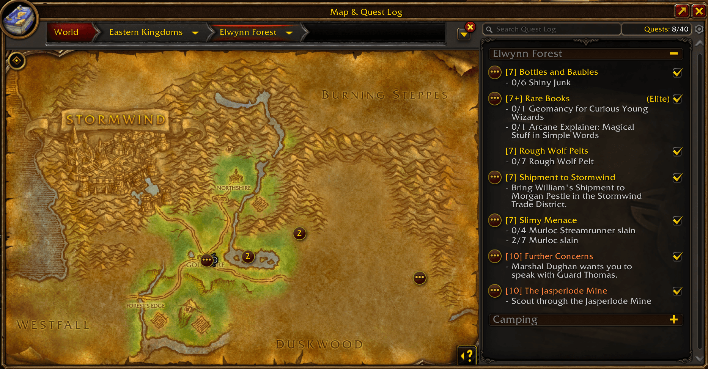
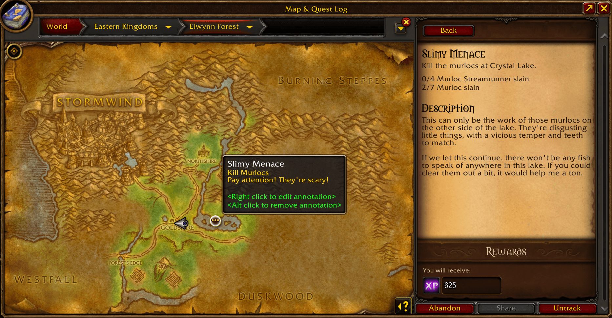
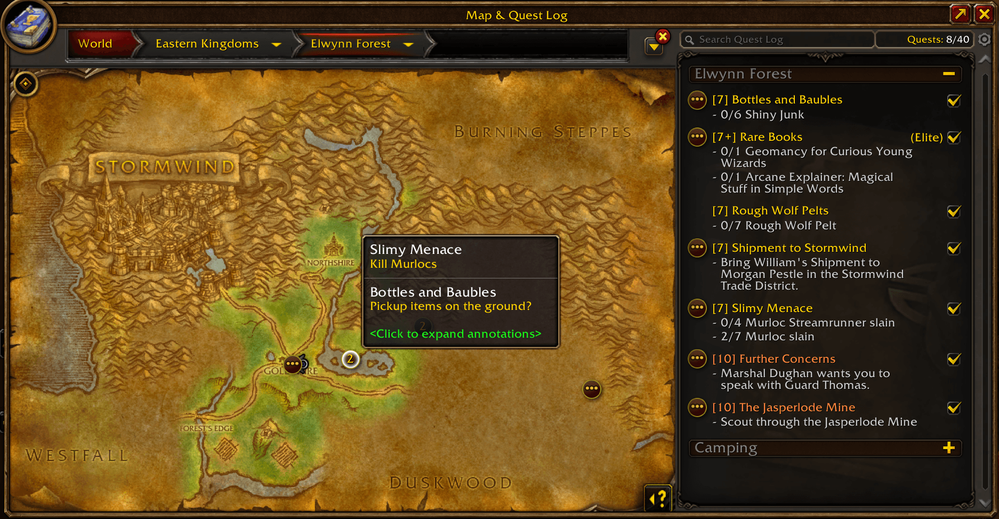
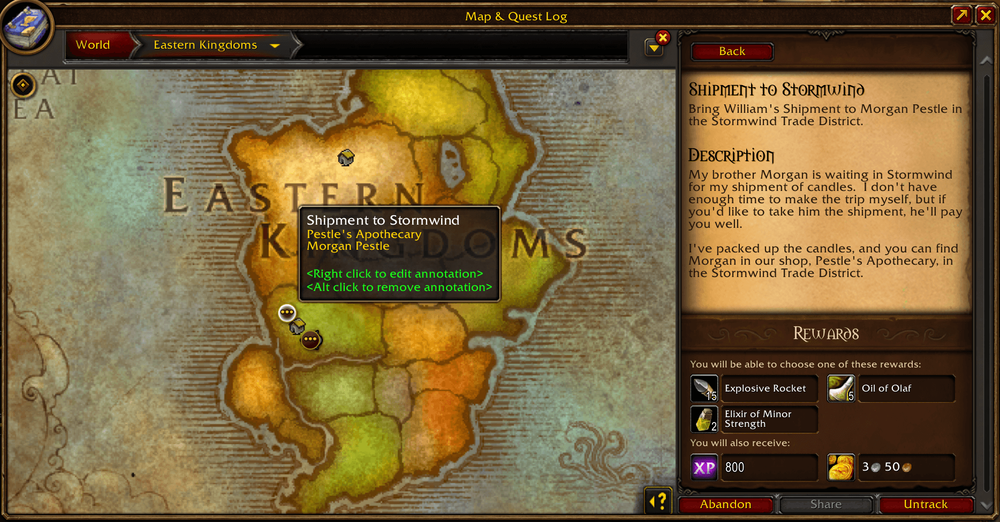
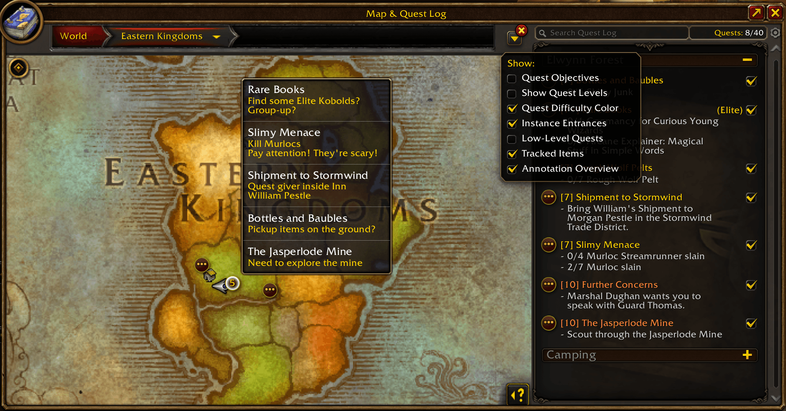

#  Smell the Roses

StR is a minimal addon for World of Warcraft: Forever that helps you in your questing, without automation or hand-holding. If you're the kind of player who likes to immerse yourself in the world, read quest text, figure out directions, and explore, then this addon is for you!

## Installation

- Install through [CurseForge](https://www.curseforge.com/wow/addons/smell-the-roses)
- Install manually:
  - Download the [latest release](https://github.com/bigfedgg/SmellTheRoses/releases/latest)
  - Unpack the archive
  - Copy the `SmellTheRoses` folder to `<WoW Forever Installation>\_classic_beta_\Interface\AddOns`

## Usage

You just accepted a quest. It tells you to kill 10 Plainstriders to the South East. With StR, you **open the quest in the quest journal**, **`Alt-Click` somewhere to the South East to add an annotation**, then `Right-Click` the annotation to add a note: "10 Plainstriders". Now while questing you can **hover over the annotation to see its content**, **click the annotation to open the quest**, or **click the quest to go to its annotations**. An indicator will also appear in the quest journal and quest tracker to let you know you have it annotated, exactly like Blizzard's default quest objectives.

  
  

While killing the Plainstriders, you discover a cave with an Elite. You're not ready for it just yet, so you open your map and **`Alt-Click` your position to add a map annotation**. These are not linked to a quest and have their own pin icon.

Once done with the Plainstriders you go back to the quest-giver and turn-in the quest. If auto-deletion is enabled in the addon configuration (it's enabled by default), your **quest annotations will be deleted after you turn in the quest**. Your map annotation will be unaffected.

> [!TIP]
> - You can **freely navigate and annotate the world map while a quest is open**. This is useful when a quest has objectives in multiple maps, or if you want to mark the quest giver's location in addition to the objective. On top of that, **clicking a quest with multi-map annotations will select the proper map level to show all the annotations at the same time**.
> - StR will **cluster quest annotations in the same location** to keep your map tidy. Click the cluster to expand it and interact with individual annotations.

  
  

## Options

### Delete annotations on quest turn-in

With this option enabled, quest annotations will be automatically deleted after you turn-in their quest.

- Where: AddOns configuration panel → Smell the Roses
- Default: Enabled

> [!TIP]
> You can also use the "Cleanup" button to delete quest annotations for any quests that were turned-in while the addon was disabled.

### Disable with Blizzard objectives

With this option enabled, the addon is effectively disabled when you enable the Quest Objectives filter in the world map. All annotations, clusters, and quest indicators are hidden, and creating annotations is disabled.

- Where: AddOns configuration panel → Smell the Roses
- Default: Disabled

### Show annotation overview

With this option enabled, annotations will appear on their parent maps. So an annotation in Mulgore will also appear at the appropriate location if you've looking at the Kalimdor map or the World Map. To keep the parent maps readable, clustering is used if some annotations are too close to each other.

- Where: Map panel → Map Filter dropdown → Annotation Overview
- Default: Enabled

  

> [!NOTE]
> Zephras Isle annotations are projected into the World Map to the West of Feralas. This is roughly the location where the Skyborne originally struck a bargain with the elementals to help them escape to Skywall. It's pretty arbitrary, but I thought it was the most fitting.

## F.A.Q

### Does this addon automate questing in any way?

No. StR doesn't create quest pins for you, nor does it show you where to go or what to do. It only allows you to create your own annotations with some helpful quest journal and map integrations.

### Why not just use something like HandyNotes?

You could! And that's what I was personally doing before writing this addon. What StR gives you is a way stronger integration with the quest journal and the map, as well as a native look and feel.

### What are the planned features?

I keep high-level plans in [TODO.md](TODO.md).

### Can you add a feature?

I would love to add more features if they fall into the scope of the addon! So please don't hesitate to open an issue and describe what you want and why you think it would fit the addon.

### Is Retail supported? Is Classic supported?

It would not be difficult to support Retail, but I doubt there would be much interest. Classic is less straightforward to support because the quest journal and map UIs are different, but I will look into it if there is demand, so don't hesitate to open an issue if this is important to you.

### Was Generative AI used to make this addon?

No. All art, code, and text (including this README file) were 100% human-made.